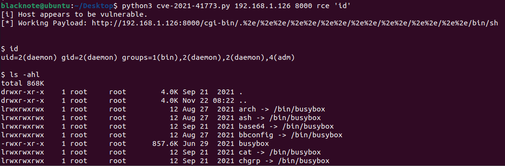
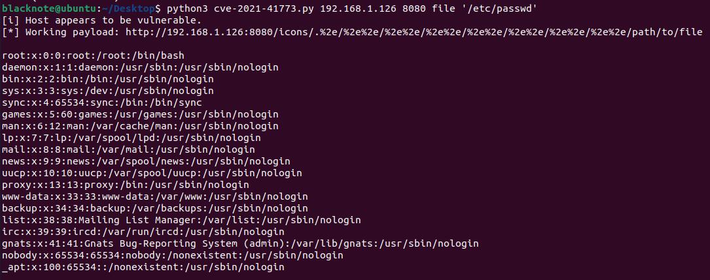

# Apache HTTP-Server 2.4.49-2.4.50 Path Traversal & Remote Code Execution
## Description
This is a PoC script for CVE-2021-41773 & CVE-2021-42013
## Usage: 
```
python3 exploit.py <rhost> <rport> <option> <cmd> | <file-absolute-path>
```
## Example:
### Remote Code Execution
```
python3 exploit.py 127.0.0.1 8080 rce 'id'
```


### Path Traversal
```
python3 exploit.py 127.0.0.1 8080 file '/etc/passwd'
```

